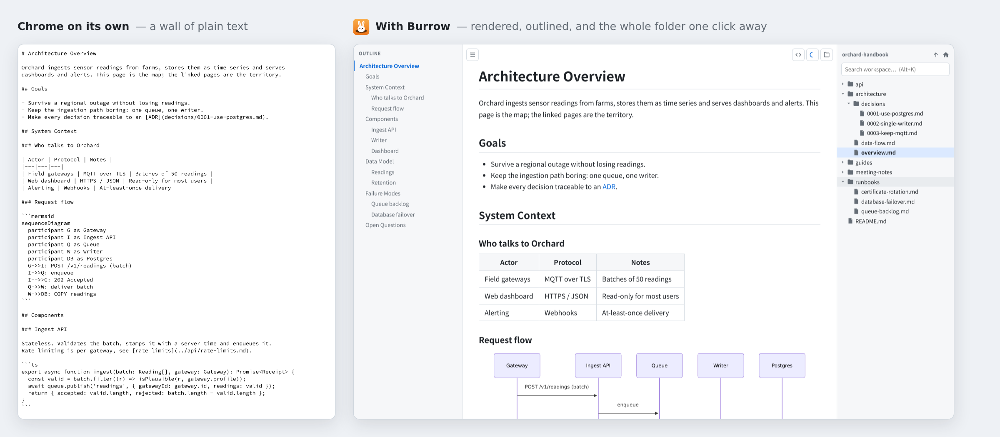
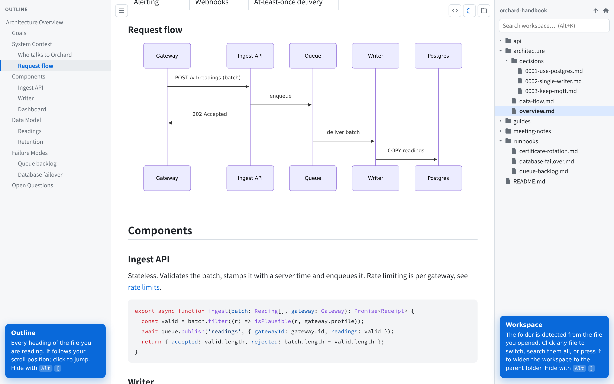
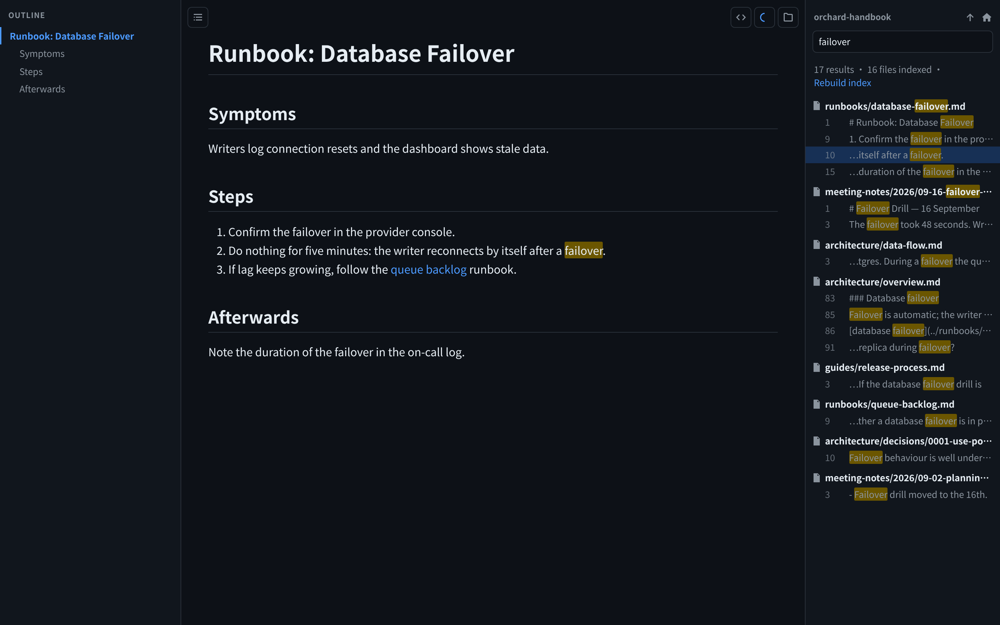
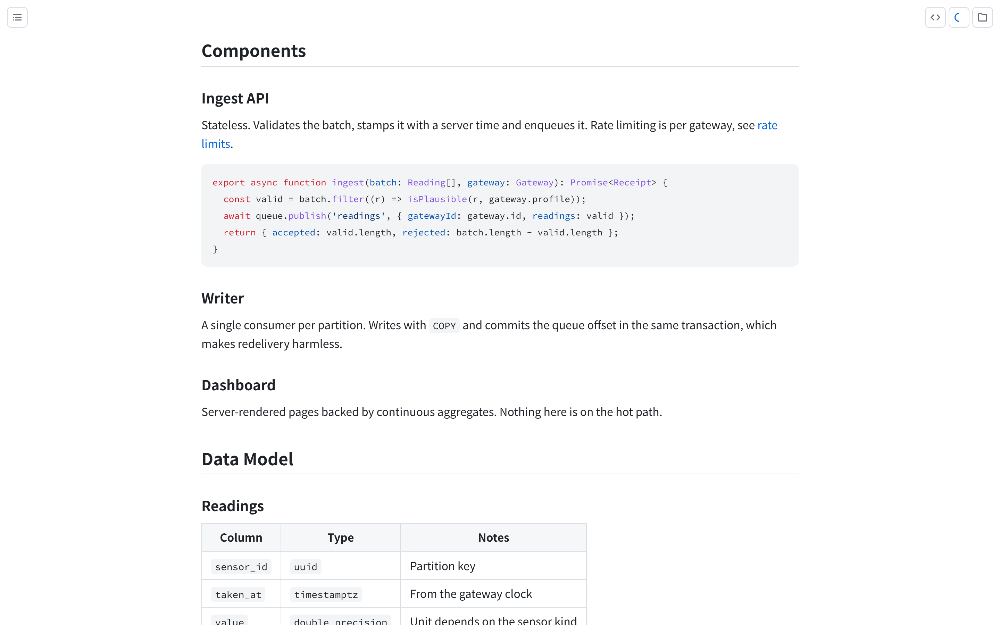

<p align="center">
  
</p>

<h1 align="center">Burrow</h1>

<p align="center">
  A Markdown workspace reader for Chrome.<br>
  Open one local <code>.md</code> file and the whole folder is one click away.
</p>

<p align="center">
  <a href="https://github.com/CalvinKirs/burrow/actions/workflows/ci.yml"></a>
  <a href="LICENSE"></a>
</p>



## Why

Notes, docs and ADRs usually live as a *folder* of Markdown files, but Markdown viewers show you one file at a time. Burrow treats the folder as the unit:

- **Workspace sidebar** (right) – every Markdown file in the folder as a tree. Click to switch; the tree, its expanded folders and your sidebar layout stay put.
- **No setup** – there is no "open folder" step. The workspace is detected from the file you opened; press **↑** to widen it to the parent folder, and Burrow remembers that root for every file under it.
- **Search the whole folder** – file names and contents. Clicking a hit opens that file at the matching line with the term highlighted, and the results stay open so the next hit is one click away.
- **Outline sidebar** (left) – the headings of the current file; follows your scroll position, click to jump.
- **Out of the way when you read** – hide either sidebar (`Alt`+`[`, `Alt`+`]`), drag to resize; the layout is remembered.
- **Rendering** – GFM tables and task lists, syntax highlighting, Mermaid diagrams, light / dark / system theme, raw view. Output is always sanitised.



| Search the folder, jump to the line | Focus mode: both sidebars hidden |
|---|---|
|  |  |

## Install

1. Download `burrow.zip` from the [latest release](https://github.com/CalvinKirs/burrow/releases/latest) and unzip it somewhere permanent (Chrome loads the extension from that folder every time it starts).
2. Open `chrome://extensions`, enable **Developer mode**, click **Load unpacked** and pick the unzipped folder.
3. Open the extension's **Details** page and turn on **Allow access to file URLs**. Chrome does not let extensions touch `file://` pages without it; the toolbar popup tells you whether it is on.
4. Open a local `.md` file in Chrome.

To build it yourself instead:

```bash
npm install
npm run build        # unpacked extension in dist/
npm run package      # the same, zipped as burrow.zip
```

## Shortcuts

| Keys | Action |
|---|---|
| `Alt` + `[` | Toggle outline |
| `Alt` + `]` | Toggle workspace |
| `Alt` + `K` | Search workspace |
| `Esc` (in search box) | Clear search, back to the file tree |

## Options

Theme, ignored folder names (dot-folders are always ignored; `node_modules` by default), the search index file limit (default 2000), raw HTML rendering (off by default; output is always sanitised), and the list of saved workspace roots.

## How it works

Chrome renders `file:///some/dir/` as a directory listing page. The background service worker fetches that page and parses it to list a folder, so no folder picker or native helper is needed. The content script only handles the UI; directory reads, root resolution and the search index live in the service worker (`src/background`). If a Chrome version refuses `file://` fetches from the worker, reads fall back to an offscreen document automatically.

Switching files is a normal page navigation, so back/forward, reload and bookmarks all work.

## Development

```bash
npm run typecheck
npm test             # unit tests (Vitest)
npm run build && npm run e2e   # Playwright, loads dist/ into Chromium
```

The first E2E run needs `npx playwright install chromium`. `npm run screenshots` regenerates the README images from `docs/demo/orchard-handbook`, and `node scripts/make-icons.mjs` re-renders the icons from `static/logo.svg`.

Releases are cut by pushing a `v*` tag whose version matches `manifest.json`; the release workflow tests, builds and attaches `burrow.zip`.

Design notes: [docs/design.md](docs/design.md).

## License

[Apache License 2.0](LICENSE). Third-party components are listed in [NOTICE](NOTICE).
