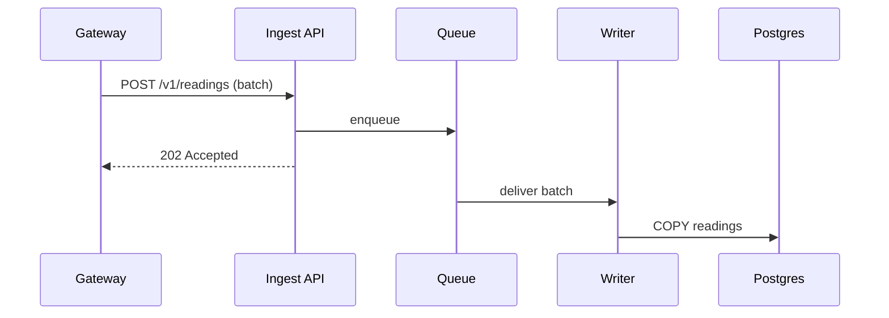

# Architecture Overview

Orchard ingests sensor readings from farms, stores them as time series and serves
dashboards and alerts. This page is the map; the linked pages are the territory.

## Goals

- Survive a regional outage without losing readings.
- Keep the ingestion path boring: one queue, one writer.
- Make every decision traceable to an [ADR](decisions/0001-use-postgres.md).

## System Context

### Who talks to Orchard

| Actor | Protocol | Notes |
|---|---|---|
| Field gateways | MQTT over TLS | Batches of 50 readings |
| Web dashboard | HTTPS / JSON | Read-only for most users |
| Alerting | Webhooks | At-least-once delivery |

### Request flow



## Components

### Ingest API

Stateless. Validates the batch, stamps it with a server time and enqueues it.
Rate limiting is per gateway, see [rate limits](../api/rate-limits.md).

```ts
export async function ingest(batch: Reading[], gateway: Gateway): Promise<Receipt> {
  const valid = batch.filter((r) => isPlausible(r, gateway.profile));
  await queue.publish('readings', { gatewayId: gateway.id, readings: valid });
  return { accepted: valid.length, rejected: batch.length - valid.length };
}
```

### Writer

A single consumer per partition. Writes with `COPY` and commits the queue offset in the
same transaction, which makes redelivery harmless.

### Dashboard

Server-rendered pages backed by continuous aggregates. Nothing here is on the hot path.

## Data Model

### Readings

| Column | Type | Notes |
|---|---|---|
| `sensor_id` | `uuid` | Partition key |
| `taken_at` | `timestamptz` | From the gateway clock |
| `value` | `double precision` | Unit depends on the sensor kind |

### Retention

Raw readings are kept for 90 days, hourly aggregates forever.

## Failure Modes

### Queue backlog

If the writer falls behind, the backlog alarm fires at ten minutes of lag. The runbook is
[queue backlog](../runbooks/queue-backlog.md).

### Database failover

Failover is automatic; the writer reconnects with backoff. See
[database failover](../runbooks/database-failover.md).

## Open Questions

- [ ] Do we need per-farm encryption keys?
- [ ] Can the dashboard read from a replica during failover?
- [x] Is MQTT still the right protocol for gateways? *(Yes — see ADR 0003.)*
